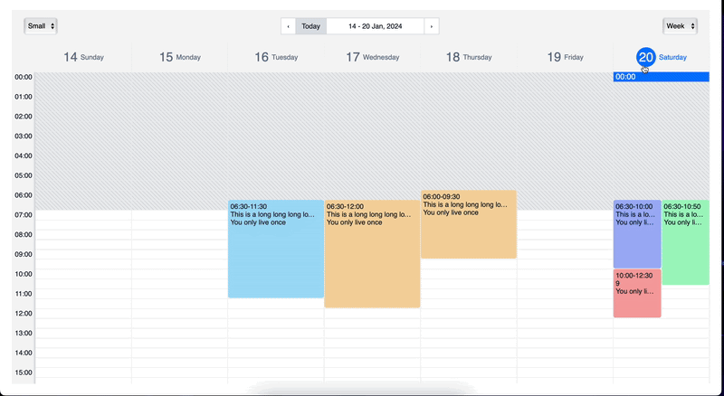

# react-cool-calendar

A simple, flexible calendar with appointments!

<p align="center">
  
</p>

## Use and Setup

`yarn add react-cool-calendar` or `npm install --save react-cool-calendar`

Make sure your calendar's container element has a height, or the calendar won't be visible

```js
<div style={{ width: '100vw', height: '100vh', padding: '24px' }}>
  <Calendar
    duration={15}
    timeType={24}
    groupTime={60}
    nowIndicator={true}
    viewMode={'WEEK'}
    dateFormat="MM/DD/YYYY"
    datetimeFormat="MM DD YYYY hh:mm:ss"
    timeFormat="hh:mm:ss"
    locale="en"
    workingTime={{
      start: 7,
      end: 20,
    }}
    dayTime={{
      start: 0,
      end: 24,
    }}
    appointments={[
      {
        id: '1',
        startTime: 7,
        duration: 120,
        title: '1',
        content: 'You only live once',
        status: EStatus.BOOKED,
        createdAt: dayjs(),
      },
      {
        id: '2',
        startTime: 8,
        duration: 200,
        title: '2',
        content: 'You only live once',
        status: EStatus.CONFIRMED,
        createdAt: dayjs(),
      },
    ]}
    apptChange={(appts: TAppointmentForUser[]) => {
      console.log(appts);
    }}
    apptClick={(appt: TAppointmentForUser) => {
      console.log(appt);
    }}
  />
</div>
```

### Localization and Date Formatting

`react-cool-calendar` uses [Day.js](https://day.js.org) for handling the date formatting and culture localization.
